<div align="center">



*Lift the task into the harness. Keep the small model. Keep the money.*

[](https://arxiv.org/abs/2607.08938)
[](LICENSE.md)


</div>

> **A study repo with a mirror inside.** This repo is OpenCnid's study of one
> paper — Yang, Zhao, Wu & Kästner, *Better Harnesses, Smaller Models:
> Building 90% Cheaper Agents via Automated Harness Adaptation*
> ([arXiv:2607.08938](https://arxiv.org/abs/2607.08938)) — plus the
> checksum-verified PDF snapshot our tooling ingests (details below).
> [The note](density-chain.md) is an original synthesis — our words, their
> findings, a locator on every claim.

> [!IMPORTANT]
> **The one-way rule.** When our note and the paper disagree, the paper wins
> and the note gets fixed. No exceptions, no negotiation. That rule is the
> entire reason we can call the note ground truth with a straight face.

## 🔗 The note

[density-chain.md](density-chain.md) is a five-tier chain-of-density study of
the paper, written to the house
[methodology](https://github.com/OpenCnid/chain-of-density): five rewrites at
a held ~150-word budget, every claim carrying a locator (§ section, Table N,
Fig. N), exact numbers only.

| tier | what it is |
|---|---|
| **T1 — sparse** | the cost problem, the lift-it-into-the-harness thesis, the 89.7%-at-4%-cost headline |
| **T2–T4** | same length each, folding in 2–3 more salient entities per round — the failure-mode framework, Table II, the diversity and capability results |
| **T5 — dense** | maximally fused, still readable, every claim traceable |
| **key results** | exact values — recovery rates, ρ = −0.96, the strategy mix percentages |
| **our take** | the only opinionated section, clearly ours, quarantined |

The one-breath version: frontier agents are great and unaffordable; small
models are affordable and flunk the frontier's harness. But routine business
tasks repeat themselves, so a meta-agent can move the repeated difficulty
out of the model and into the harness — a plan skeleton here, a filtered
tool set there, a hook that programmatically refuses the failure mode — and
suddenly a 26B model is matching the frontier at 4% of the price. The
catch, quantified twice over: it only works when the task actually repeats
(ρ = −0.96), and the harness amplifies capability rather than minting it.

## 🏔️ Standing on the shoulders of giants

The actual science was done by **Chenyang Yang**, **Xinran Zhao**,
**Tongshuang Wu**, and **Christian Kästner**, all at Carnegie Mellon
University, affiliations as printed on the paper. They built the framework,
the optimizer, and the task suite, spent the $1,260 so you don't have to,
and released the code
([malusamayo/migration-analysis](https://github.com/malusamayo/migration-analysis)).
Cite them, not us; BibTeX in [CITATION.md](CITATION.md).

## Direct PDF download

```text
https://raw.githubusercontent.com/OpenCnid/better-harnesses-smaller-models/main/arxiv-2607.08938v1.pdf
```

[Download the PDF](https://raw.githubusercontent.com/OpenCnid/better-harnesses-smaller-models/main/arxiv-2607.08938v1.pdf)

```bash
curl -L -o arxiv-2607.08938v1.pdf \
  https://raw.githubusercontent.com/OpenCnid/better-harnesses-smaller-models/main/arxiv-2607.08938v1.pdf
```

```python
from urllib.request import urlretrieve

url = "https://raw.githubusercontent.com/OpenCnid/better-harnesses-smaller-models/main/arxiv-2607.08938v1.pdf"
urlretrieve(url, "arxiv-2607.08938v1.pdf")
```

Prefer it straight from the source (always the current version, no
middlemen)?

```bash
curl -L -o better-harnesses.pdf https://arxiv.org/pdf/2607.08938
```

## Artifact details

| Field | Value |
|---|---|
| File | `arxiv-2607.08938v1.pdf` |
| arXiv identifier | `2607.08938v1` |
| Format | Original text-searchable arXiv PDF |
| Pages | 12 |
| Size | 696,336 bytes |
| SHA-256 | `3fac74f3152a8ec2cd6d28e98a6e5cff323fea9c39e7328bdb38bfb0b3003b17` |
| Primary source | [arXiv abstract](https://arxiv.org/abs/2607.08938v1) |
| Versioned PDF | [arXiv PDF](https://arxiv.org/pdf/2607.08938v1) |
| DOI | [10.48550/arXiv.2607.08938](https://doi.org/10.48550/arXiv.2607.08938) |
| Submitted | July 9, 2026 |
| Snapshot downloaded | July 16, 2026 |

Verify the downloaded bytes with:

```bash
sha256sum arxiv-2607.08938v1.pdf
```

## Source and attribution

The paper is by Chenyang Yang, Xinran Zhao, Tongshuang Wu, and Christian
Kästner.

> Yang, C., Zhao, X., Wu, T., & Kästner, C. (2026). *Better Harnesses,
> Smaller Models: Building 90% Cheaper Agents via Automated Harness
> Adaptation*. arXiv:2607.08938v1. https://doi.org/10.48550/arXiv.2607.08938

When citing the research, cite the original paper rather than this
convenience mirror. See [CITATION.md](CITATION.md) for BibTeX.

## Provenance

The PDF in this repository is the unchanged file downloaded from the
versioned arXiv PDF endpoint on July 16, 2026. No pages, metadata, figures,
or text were modified. Consult the [arXiv record](https://arxiv.org/abs/2607.08938)
for newer versions. The note in [density-chain.md](density-chain.md) was
verified against a fresh fetch of the same v1 PDF on July 18, 2026.

## Kept honest by machine

[`index.json`](index.json) is the machine-readable face of this repo: the
source pin, the verification date, the tags. **Trellis**, our current
project, consumes those indexes and owns freshness — when arXiv revs a v2,
the note gets flagged before we get embarrassed.

## Honest notes

- **We are not affiliated with the authors** or Carnegie Mellon. We just
  appreciate a paper that publishes its budget line.
- **The mirror is a working artifact.** Our research tooling ingests these
  exact bytes and checks the hash; the arXiv record stays canonical, and the
  paper keeps its authors' CC BY 4.0 license.
- **The note is lossy by construction.** The locators are the refund policy:
  any claim can be walked back into the paper in one hop.
- **We will get things wrong.** When we do, the fix lands source-first and
  the correction is public history. If we've mangled this paper, open an
  issue — correcting the record *is* the project.

## License

The paper: [CC BY 4.0](https://creativecommons.org/licenses/by/4.0/) per the
arXiv record, © its authors. Our prose: [CC BY 4.0](LICENSE.md) © OpenCnid
Labs.

## Layout

```
density-chain.md          the five-tier note (the artifact)
index.json                machine-readable pin + verification metadata
arxiv-2607.08938v1.pdf    the checksum-verified snapshot (see Artifact details)
CITATION.md               BibTeX — cite the humans, not us
AGENTS.md                 the agents' front door
LICENSE.md                CC BY 4.0 for our prose; the paper keeps its own
assets/                   banner art (the scaffold is load-bearing)
```

The methodology — METHOD.md, the synthesis prompt, the `density-chain` skill
— lives canonically in
[chain-of-density](https://github.com/OpenCnid/chain-of-density) and is
linked, not copied.

---

<div align="center">
<sub>This README was assembled by a large model that read a paper about replacing large models. It has decided not to take it personally: the harness, after all, was the hero.</sub>
</div>
